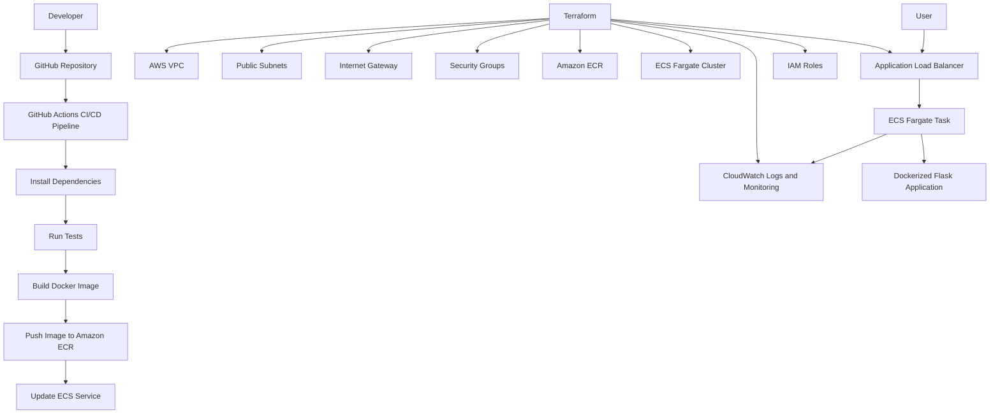

# DevOps Engineer Practical Challenge - Production-Ready Application Deployment

## Project Overview

This project is a production-ready DevOps deployment of a simple Flask web application on AWS.

The application is containerized with Docker, deployed on AWS ECS Fargate, provisioned with Terraform, and automated using a GitHub Actions CI/CD pipeline.

The goal of this project is to demonstrate practical DevOps skills including:

- Infrastructure as Code
- Containerization
- Cloud deployment
- CI/CD automation
- Monitoring and logging
- Clear technical documentation

---

## Live Application

Application URL:

```text
http://devops-challenge-alb-1787107386.us-east-1.elb.amazonaws.com
```

Health check endpoint:

```text
http://devops-challenge-alb-1787107386.us-east-1.elb.amazonaws.com/health
```

Example health response:

```json
{
  "status": "healthy"
}
```

---

## Architecture Overview

The architecture follows a simple and repeatable cloud deployment pattern.

A developer pushes code to GitHub. GitHub Actions automatically runs tests, builds a Docker image, pushes the image to Amazon ECR, and forces a new deployment on Amazon ECS Fargate. The application is exposed publicly through an Application Load Balancer. Logs and metrics are handled using Amazon CloudWatch.



---

## Technologies Used

| Category | Technology |
|---|---|
| Cloud Provider | AWS |
| Compute Service | ECS Fargate |
| Container Registry | Amazon ECR |
| Load Balancer | AWS Application Load Balancer |
| Monitoring and Logs | Amazon CloudWatch |
| Infrastructure as Code | Terraform |
| CI/CD | GitHub Actions |
| Containerization | Docker |
| Application Framework | Python Flask |
| Testing | Pytest |

---

## Project Structure

```text
devops-challenge/
├── app/
│   ├── app.py
│   ├── Dockerfile
│   ├── requirements.txt
│   └── test_app.py
│
├── terraform/
│   ├── main.tf
│   ├── variables.tf
│   ├── outputs.tf
│   └── modules/
│       ├── networking/
│       │   ├── main.tf
│       │   ├── variables.tf
│       │   └── outputs.tf
│       ├── ecr/
│       │   ├── main.tf
│       │   ├── variables.tf
│       │   └── outputs.tf
│       ├── ecs/
│       │   ├── main.tf
│       │   ├── variables.tf
│       │   └── outputs.tf
│       └── monitoring/
│           ├── main.tf
│           ├── variables.tf
│           └── outputs.tf
│
├── .github/
│   └── workflows/
│       └── ci-cd.yml
│
├── .gitignore
└── README.md
```

---

## Application

The application is a simple Python Flask API.

It exposes two endpoints:

| Endpoint | Description |
|---|---|
| `/` | Returns application status and version |
| `/health` | Returns health check status for the load balancer |

Example root response:

```json
{
  "message": "DevOps Challenge App is running!",
  "status": "healthy",
  "version": "1.0.0"
}
```

---

## Infrastructure as Code

Terraform is used to provision and manage the AWS infrastructure.

The Terraform code is modular and separated into logical components:

| Module | Purpose |
|---|---|
| `networking` | Creates VPC, public subnets, internet gateway, route tables, and security groups |
| `ecr` | Creates the Amazon ECR repository for Docker images |
| `ecs` | Creates ECS cluster, task definition, ECS service, ALB, listener, and target group |
| `monitoring` | Creates CloudWatch monitoring resources |

Terraform provisions the following AWS resources:

- VPC
- Public subnets
- Internet gateway
- Route table and route table associations
- Security groups
- Amazon ECR repository
- ECS cluster
- ECS Fargate task definition
- ECS service
- Application Load Balancer
- Target group
- ALB listener
- CloudWatch log group
- CloudWatch dashboard/alarm
- IAM role for ECS task execution

---

## CI/CD Pipeline

GitHub Actions is used to automate the build, test, and deployment process.

The pipeline runs automatically whenever code is pushed to the `main` branch.

### Pipeline Stages

1. Checkout source code
2. Set up Python
3. Install dependencies
4. Run tests with Pytest
5. Configure AWS credentials
6. Login to Amazon ECR
7. Build Docker image
8. Tag Docker image
9. Push image to Amazon ECR
10. Deploy latest image to ECS
11. Wait for ECS service stability

This satisfies the required CI/CD flow:

```text
Build → Test → Deploy
```

---

## GitHub Actions Workflow

The CI/CD workflow is located at:

```text
.github/workflows/ci-cd.yml
```

Required GitHub repository secrets:

| Secret Name | Purpose |
|---|---|
| `AWS_ACCESS_KEY_ID` | Allows GitHub Actions to authenticate with AWS |
| `AWS_SECRET_ACCESS_KEY` | Secret key for AWS authentication |

No AWS credentials are stored directly in the repository.

---

## Docker

The application is containerized using Docker.

The Dockerfile is located at:

```text
app/Dockerfile
```

The Docker image is built from a Python slim image and runs the Flask app using Gunicorn.

Manual Docker build command:

```bash
cd app
docker build -t devops-app .
```

Run locally:

```bash
docker run -p 5000:5000 devops-app
```

Test locally:

```bash
curl http://localhost:5000
curl http://localhost:5000/health
```

---

## Deployment Steps

### 1. Clone the repository

```bash
git clone https://github.com/10Johnny/devops-challenge.git
cd devops-challenge
```

### 2. Configure AWS CLI

```bash
aws configure
```

Required values:

```text
AWS Access Key ID
AWS Secret Access Key
Default region: us-east-1
Default output format: json
```

### 3. Deploy infrastructure with Terraform

```bash
cd terraform
terraform init
terraform validate
terraform plan
terraform apply
```

Type `yes` when Terraform asks for confirmation.

### 4. Build and push Docker image manually if needed

```bash
cd ../app

AWS_REGION=us-east-1
ACCOUNT_ID=$(aws sts get-caller-identity --query Account --output text)
ECR_URL=$ACCOUNT_ID.dkr.ecr.$AWS_REGION.amazonaws.com/devops-challenge-production

aws ecr get-login-password --region $AWS_REGION | docker login --username AWS --password-stdin $ACCOUNT_ID.dkr.ecr.$AWS_REGION.amazonaws.com

docker build -t devops-app .
docker tag devops-app:latest $ECR_URL:latest
docker push $ECR_URL:latest
```

### 5. Trigger automated deployment

After the GitHub Actions secrets are configured, deployment is automatic on push to `main`.

```bash
git add .
git commit -m "Update application"
git push origin main
```

GitHub Actions will build, test, push the Docker image, and redeploy the ECS service automatically.

---

## Testing

The project includes basic tests using Pytest.

Test file:

```text
app/test_app.py
```

Run tests locally:

```bash
cd devops-challenge
python3 -m venv venv
source venv/bin/activate
pip install -r app/requirements.txt
pip install pytest
pytest app
```

Expected result:

```text
2 passed
```

---

## Monitoring and Logging

AWS CloudWatch is used for basic monitoring and logging.

The ECS task sends container logs to CloudWatch. CloudWatch also provides visibility into ECS service metrics such as CPU and memory utilization.

Monitoring resources include:

- CloudWatch log group for ECS task logs
- CloudWatch dashboard/alarm for basic service monitoring
- ECS service events for deployment and health status

---

## Verification Commands

Check ECS service status:

```bash
aws ecs describe-services \
  --cluster devops-challenge-production-cluster \
  --services devops-challenge-production-service \
  --region us-east-1 \
  --query 'services[0].{Desired:desiredCount,Running:runningCount,Pending:pendingCount,Status:status}' \
  --output table
```

Expected output:

```text
Desired: 1
Running: 1
Pending: 0
Status: ACTIVE
```

Test the live application:

```bash
curl http://devops-challenge-alb-1787107386.us-east-1.elb.amazonaws.com
```

Test the health endpoint:

```bash
curl http://devops-challenge-alb-1787107386.us-east-1.elb.amazonaws.com/health
```

Check Terraform state:

```bash
cd terraform
terraform plan
```

Expected result:

```text
No changes. Your infrastructure matches the configuration.
```

---

## Design Decisions

### Why ECS Fargate?

ECS Fargate was chosen because it allows containerized applications to run without manually managing EC2 servers. This makes the deployment simpler, scalable, and more production-friendly for this assessment.

### Why Terraform?

Terraform was used because it allows infrastructure to be defined as code. This makes the infrastructure repeatable, reviewable, and easy to recreate.

### Why Docker?

Docker ensures that the application runs consistently across local development, CI/CD, and AWS.

### Why GitHub Actions?

GitHub Actions was selected because it integrates directly with the GitHub repository and provides a simple way to automate build, test, and deployment steps.

### Why CloudWatch?

CloudWatch was used because it is the native AWS service for logs, metrics, and monitoring ECS workloads.

---

## Assumptions

- The application is a simple sample service for the purpose of the DevOps assessment.
- The deployment region is `us-east-1`.
- One ECS task is sufficient for this assessment.
- Public subnets are used for simplicity.
- HTTP is used because no custom domain or SSL certificate was required.
- GitHub Actions secrets are configured manually in the GitHub repository.

---

## Limitations and Future Improvements

The current solution is functional and production-oriented, but it can be improved further.

Possible improvements include:

- Add HTTPS using AWS Certificate Manager and a custom domain.
- Store Terraform state remotely using S3 and DynamoDB locking.
- Add separate staging and production environments.
- Add ECS autoscaling.
- Add more detailed CloudWatch alarms.
- Add vulnerability scanning for Docker images.
- Use least-privilege IAM permissions for GitHub Actions instead of broad deployment permissions.
- Add automated rollback strategy.
- Add private subnets with NAT gateway for improved network security.
- Add application performance monitoring.

---

## Final Status

This project successfully demonstrates:

- Dockerized application
- AWS cloud deployment
- Terraform Infrastructure as Code
- Modular infrastructure structure
- GitHub Actions CI/CD pipeline
- Automated build, test, and deploy process
- CloudWatch monitoring and logging
- Clear documentation and architecture overview
